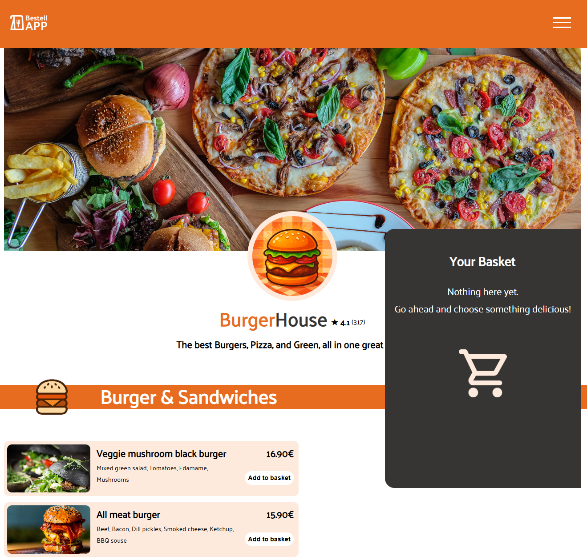
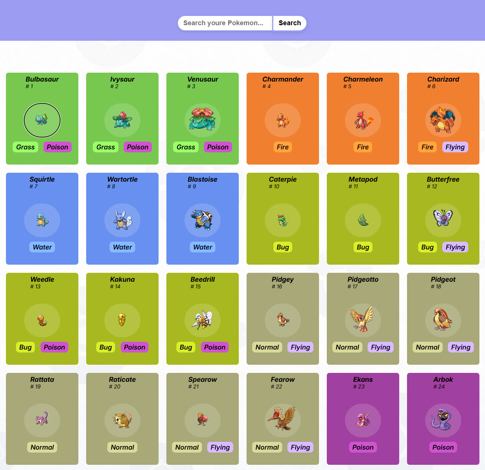

# Hi, I'm Maximilian 👋
 

## About me
I'm currently learning and building projects with JavaScript and Python.
Focused on improving my development skills and working on real-world projects.
 

 ## Projects
 <table align="center">
   <tr>
     <td >
      <h3>Order App</h3>
      
        
      
      
         
      
Food ordering interface built with JavaScript and HTML/CSS.

         
     </td>
     <td>
      <h3>Pokedex</h3>
      
        
      
      
         
      
Pokedex built with JavaScript and API integration.

         
     </td>
    </tr>
 </table>
👉 Check out my repositories for more projects
  

## 🛠️ Tech Stack
 

**Languages**

  
  
  
  
  
  
  
  
  

 

**Tools**

## GitHub Activity

  

 

<!-- Pacman 
<picture>
  <source media="(prefers-color-scheme: dark)" srcset="https://raw.githubusercontent.com/Xam-585/Xam-585/output/pacman-contribution-graph-dark.svg">
  <source media="(prefers-color-scheme: light)" srcset="https://raw.githubusercontent.com/Xam-585/Xam-585/output/pacman-contribution-graph.svg">
  
</picture>
-->

  ## Contact
  
  <h3>Feel free to check out my repositories or connect with me.</h3>
  <!-- 

  

-->
